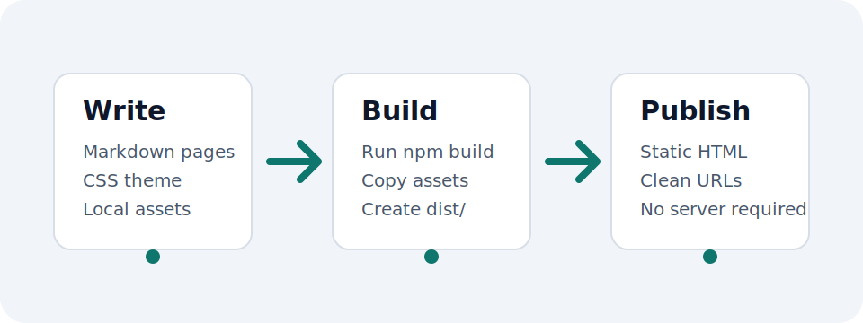

# tiny.md

A small static site generator for people who want a website they can understand.



tiny.md turns a `site/` folder into a complete `dist/` folder. Write pages in Markdown, keep assets beside the pages that use them, and customize the design with plain CSS.

## Why it exists

- The authoring model is easy to remember.
- The generated output is plain static HTML, CSS, and assets.
- The generated HTML is semantic and ready to publish.
- Search metadata, canonical URLs, social cards, and sitemaps are built in.
- Default styles are automatic, but your CSS still wins.

## How it works

Each page is a folder with an `index.md` file:

```txt
site/
  site.md
  content/
    index.md
    notes/
      index.md
  theme/
    style.css
```

The build creates clean static files:

```txt
dist/
  index.html
  notes/
    index.html
  default.css
  style.css
```

## Start here

Create a new site with one command:

```sh
npx create-tiny-md my-site
```

Then edit Markdown files in `site/content/` and run `npm run build` when you are ready to publish.

[Follow the quickstart](/quickstart)
